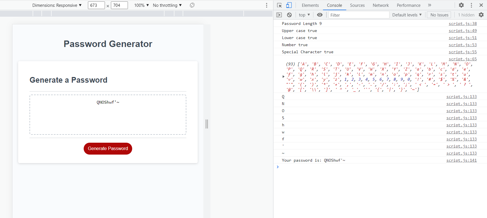

# Homework #3

## Description

- My motivation was to sharpen my Javascript skills 
- Building this project helped me learn a lot even though I struggled and stuck there for hours. But in the end, it was worth it.
- It solved that the password finally showed up in text area by using Push operater.
- I learned how to randomly select from an array, created different outcomes for password if it was chosen differently, and how to show the password on the website.

## Installation

- Created a repository on github.
- Cloned starter code with my local machine.
- Watched class recordings on how to use Math.random, function, and any materials related to the assignment.
- Googled anything if i got stuck.
- When it was done, I copied the URL link to submit the homework.

## Usage 

- Click generate password to start.
- Choose any characters between 8 to 128.
- Click OK to include any criteria, if not click cancel.
- At least one type of characters must be included.
- Password will be generated afterward.

# Credits

- NA

# License

MIT License

Copyright (c) [2023] [Kin Ho]

Permission is hereby granted, free of charge, to any person obtaining a copy
of this software and associated documentation files (the "Software"), to deal
in the Software without restriction, including without limitation the rights
to use, copy, modify, merge, publish, distribute, sublicense, and/or sell
copies of the Software, and to permit persons to whom the Software is
furnished to do so, subject to the following conditions:

The above copyright notice and this permission notice shall be included in all
copies or substantial portions of the Software.

THE SOFTWARE IS PROVIDED "AS IS", WITHOUT WARRANTY OF ANY KIND, EXPRESS OR
IMPLIED, INCLUDING BUT NOT LIMITED TO THE WARRANTIES OF MERCHANTABILITY,
FITNESS FOR A PARTICULAR PURPOSE AND NONINFRINGEMENT. IN NO EVENT SHALL THE
AUTHORS OR COPYRIGHT HOLDERS BE LIABLE FOR ANY CLAIM, DAMAGES OR OTHER
LIABILITY, WHETHER IN AN ACTION OF CONTRACT, TORT OR OTHERWISE, ARISING FROM,
OUT OF OR IN CONNECTION WITH THE SOFTWARE OR THE USE OR OTHER DEALINGS IN THE
SOFTWARE.
